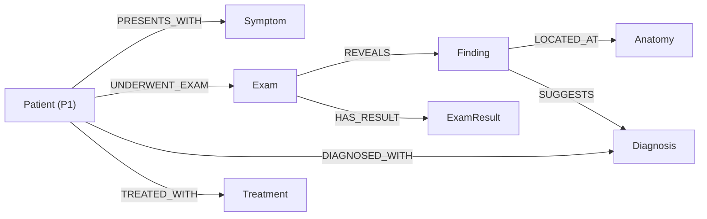

# P1 - Primeira Entrega
*2026.2 Processamento de Línguas Naturais*

# Estrutura do projeto

```
.
│
└── project1-final
    ├── README.md  
    ├── data
    │   ├── processed      <- dados finais usados para a publicação
    │   └── raw            <- dados originais sem modificações
    ├── sample 
    ├── pipelines
    │   └── notebooks      <- Jupyter notebooks ou equivalentes
    ├── src                <- fonte em linguagem de programação ou sistema 
    └── assets             <- mídias usadas no projeto
        ├── images         <- imagens usadas no texto do README.md
        └── slides         <- slides em PDF
```

# Projeto NLP - NER para Casos Clínicos
# Project NLP - NER for Clinical Cases

## Slides

> [Link para a apresentação em PDF](assets/slides/apresentacao_p3.pdf)

## Metodologia

A extração de entidades e a construção do Grafo de Conhecimento Médico (*Knowledge Graph*) a partir de casos clínicos foram executadas por meio de **três abordagens paralelas e independentes**, desenvolvidas para permitir a comparação direta dos resultados obtidos por diferentes técnicas de Processamento de Linguagem Natural (PLN):

```
                       +-------------------+
                       |   Casos Clínicos  |
                       |    (Texto Raw)    |
                       +---------+---------+
                                 |
           +---------------------+---------------------+
           |                     |                     |
           v                     v                     v
+-------------------+   +-------------------+   +-------------------+
|    Abordagem 1    |   |    Abordagem 2    |   |    Abordagem 3    |
| 01_bpe_subword... |   | 02_pos_tagging... |   | 03_rule_based...  |
+---------+---------+   +---------+---------+   +---------+---------+
          |                     |                     |
          v                     v                     v
   [Grafo PMI HTML]      [Grafo Mermaid MD]    [Grafo CSV/HTML/PNG]
```

1. **Abordagem 1: Tokenização Regular & Co-ocorrência PMI** (`01_bpe_subword_pipeline.py`)
   - Focada na extração estatística de co-ocorrência entre termos médicos preservando padrões de unidades e faixas de medição via expressões regulares adaptadas e segmentação por subpalavras (*Byte Pair Encoding*).
   - Utiliza a métrica de *Pointwise Mutual Information* (PMI) para conectar automaticamente os termos que co-ocorrem com frequência relevante no texto.

2. **Abordagem 2: POS-tagging e Dicionário Médico** (`02_pos_tagging_pipeline.py`)
   - Focada na estrutura sintática das sentenças, utilizando marcadores gramaticais (*Part-of-Speech Tagging*) e extratores de sintagmas nominais (*Noun Chunks* com `RegexpParser`).
   - Identifica relações dinâmicas e hierárquicas a partir de padrões preposicionais e verbais do texto clínico.

3. **Abordagem 3: Extração Baseada em Regras e Dicionário Médico** (`03_rule_based_pipeline.py`)
   - Focada em regras heurísticas orientadas por vocabulário especializado (combinação de termos MeSH, metadados e sufixos médicos como *-itis*, *-ectomy*, *-oma*).
   - Implementa detecção contextual de negação (diferenciando sintomas presentes de negados e diagnósticos confirmados de descartados) e pareamento direto de exames, medições e anatomias aos pacientes.

---

## Scripts do Pipeline

### 1. `01_bpe_subword_pipeline.py` (Abordagem 1: Tokenização, Subpalavras e Grafo PMI)
* **Objetivo:** Tokenizar textos clínicos brutos lidando com terminologias complexas e criar um grafo de co-ocorrência estatístico usando PMI (*Pointwise Mutual Information*).
* **Principais Funcionalidades:**
  * **Tokenização por Regex Adaptada:** Utiliza expressões regulares avançadas para identificar e preservar valores numéricos com unidades clínicas (`mg/L`, `U/L`, `cm`), faixas de medição (`10-20 mg/L`), códigos alfanuméricos e termos hifenizados.
  * **Algoritmo Byte Pair Encoding (BPE):** Implementação do BPE para segmentação de subpalavras e análise do vocabulário do corpus.
  * **Grafo PMI via NetworkX & PyVis:** Calcula o PMI dos bigramas em uma janela deslizante ajustável para capturar associações significativas de termos e gera uma visualização interativa em HTML (`01_medical_knowledge_graph.html`).

---

### 2. `02_pos_tagging_pipeline.py` (Abordagem 2: POS-Tagging e Chunking Sintático)
* **Objetivo:** Processar e extrair entidades sintáticas (*sintagmas nominais*) e mapear relações contextuais em frases de casos clínicos a partir da estrutura gramatical.
* **Principais Funcionalidades:**
  * **Part-of-Speech Tagging & Chunking:** Emprega o `nltk.pos_tag` juntamente com expressões regulares de gramática (`RegexpParser`) para isolar blocos de substantivos e adjetivos médicos (ex: *"acute abdominal pain"*).
  * **Classificação Genérica baseada em Vocabulário Médico:** Mapeia termos para tipos médicos centrais (*Symptom*, *Exam*, *Finding*, *Anatomy*, *Diagnosis*, *Treatment*, *Outcome*, *ExamResult*).
  * **Construção de Relações Contextuais:** Analisa padrões preposicionais e verbais nas sentenças para definir arestas lógicas como `PRESENTS_WITH`, `UNDERWENT_EXAM`, `REVEALS`, `LOCATED_AT` e `DIAGNOSED_WITH`.
  * **Exportação para Mermaid:** Gera especificações de diagrama hierárquico em formato Markdown/Mermaid (`src/pos-tagging-graph.md`).

---

### 3. `03_rule_based_pipeline.py` (Abordagem 3: Regras Heurísticas, Negação e Exportação de Grafos)
* **Objetivo:** Construir e exportar um Grafo de Conhecimento Médico (KG) detalhado centrado no paciente utilizando regras heurísticas e mapeamento de dicionário.
* **Principais Funcionalidades:**
  * **Vocabulário Médico Dinâmico:** Constrói um vocabulário unificado utilizando *MeSH terms* e palavras-chave de `metadata.csv`, combinados com um extrator de sufixos médicos (*-itis*, *-ectomy*, *-oma*, *-scopy*).
  * **Análise Contextual de Negação:** Analisa o escopo prévio na frase para categorizar relações afirmativas (`PRESENTS_WITH`, `DIAGNOSED_WITH`) ou negadas (`DENIES_SYMPTOM`, `RULED_OUT`).
  * **Extração de Medições & Valores Laboratoriais:** Captura automaticamente pares de valores e unidades e conecta exames a seus resultados (`HAS_RESULT`, `HAS_SIZE`, `HAS_LAB_VALUE`).
  * **Geração de Grafos Estáticos e Interativos:** 
    * Exporta os arquivos estruturados em tabelas CSV (`nodes.csv` e `edges.csv`).
    * Utiliza **Graphviz** para renderização estática (`.png`) e **PyVis** para visualização interativa e hierárquica em HTML (`.html`).

---

## Trabalhos Estudados

> Foi estudada a aplicação de técnicas de pos-tagging utilizando a biblioteca NLTK no site https://medium.com/turing-talks/pos-tagging-da-teoria-%C3%A0-implementa%C3%A7%C3%A3o-eafa59c9d115

## Modelo Lógico



## Análises que podem ser realizadas
1. **Perfil Fenotípico do Paciente:** Agrupamento de sintomas e sinais clínicos extraídos para traçar um panorama exato do estado do paciente.
2. **Mapeamento de Comorbidades:** Identificação de condições preexistentes mencionadas no histórico para analisar interações entre doenças.
3. **Padrões de Prescrição:** Análise de dosagens, frequências e vias de administração para avaliar a adesão a protocolos clínicos.
4. **Interações Medicamentosas Potenciais:** Varredura de múltiplos fármacos citados no texto para checar riscos de toxicidade ou perda de eficácia.

## Ferramentas

* **Python 3.10+**: Linguagem principal.
* **NLTK (Natural Language Toolkit)**: Utilizado para tokenização, POS-Tagging, parsing gramatical e cálculo de estatísticas de bigramas (PMI).
* **NetworkX**: Criação, manipulação e gerenciamento das estruturas de dados dos grafos orientados e não-orientados.
* **PyVis & Graphviz**: Geração de visualizações dinâmicas em HTML e renderização de grafos estáticos em formato PNG.
* **Pandas**: Manipulação, limpeza e exportação das tabelas de nós e arestas.

## Resultados

A execução paralela das três abordagens permitiu comparar os diferentes níveis de abstração e precisão na geração dos grafos de conhecimento, gerando tanto representações estatísticas interativas quanto grafos sintáticos e heurísticos estruturados.

## Como Modelos de Linguagem foram Usados

Modelos de linguagem foram empregados para auxiliar na geração do README e na visualização dos grafos de conhecimento (interface de visualização). Validar e corrigir ideias utilizadas para extração de informação dos casos clínicos não estruturados. Auxiliar na geração das funções de PMI, POS-tagging e heurísticas utilizadas na diferentes abordagens.
