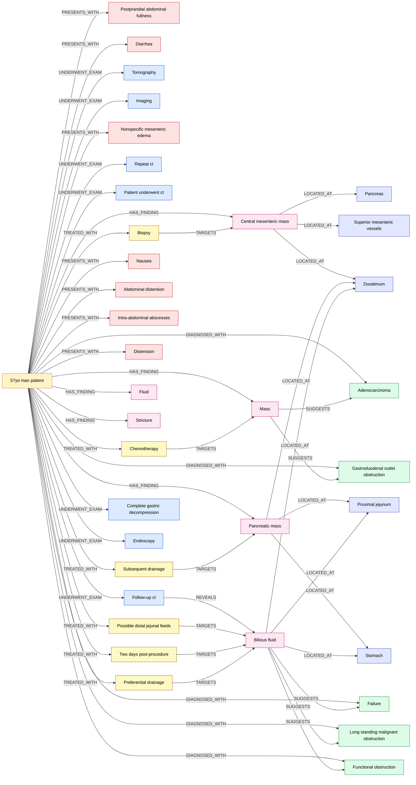

```mermaid
flowchart LR
  classDef patient fill:#fef3c7,stroke:#d97706,color:#000
  classDef symptom fill:#fee2e2,stroke:#b91c1c,color:#000
  classDef finding fill:#fce7f3,stroke:#be185d,color:#000
  classDef exam fill:#dbeafe,stroke:#1d4ed8,color:#000
  classDef examresult fill:#cffafe,stroke:#0e7490,color:#000
  classDef anatomy fill:#e0e7ff,stroke:#4338ca,color:#000
  classDef diagnosis fill:#dcfce7,stroke:#15803d,color:#000
  classDef treatment fill:#fef9c3,stroke:#a16207,color:#000
  classDef outcome fill:#f3e8ff,stroke:#7e22ce,color:#000

  P1["57yo man patient"]:::patient
  S1["Postprandial abdominal fullness"]:::symptom
  S2["Diarrhea"]:::symptom
  E1["Tomography"]:::exam
  E2["Imaging"]:::exam
  S3["Nonspecific mesenteric edema"]:::symptom
  E3["Repeat ct"]:::exam
  F1["Central mesenteric mass"]:::finding
  A1["Pancreas"]:::anatomy
  A2["Superior mesenteric vessels"]:::anatomy
  A3["Duodenum"]:::anatomy
  E4["Patient underwent ct"]:::exam
  T1["Biopsy"]:::treatment
  F2["Mass"]:::finding
  D1["Adenocarcinoma"]:::diagnosis
  T2["Chemotherapy"]:::treatment
  S4["Nausea"]:::symptom
  S5["Abdominal distention"]:::symptom
  D2["Gastroduodenal outlet obstruction"]:::diagnosis
  F3["Pancreatic mass"]:::finding
  S6["Intra-abdominal abscesses"]:::symptom
  A4["Proximal jejunum"]:::anatomy
  E5["Follow-up ct"]:::exam
  S7["Distension"]:::symptom
  A5["Stomach"]:::anatomy
  T3["Subsequent drainage"]:::treatment
  F4["Fluid"]:::finding
  F5["Stricture"]:::finding
  F6["Bilious fluid"]:::finding
  D3["Failure"]:::diagnosis
  D4["Long-standing malignant obstruction"]:::diagnosis
  T4["Possible distal jejunal feeds"]:::treatment
  T5["Two days post-procedure"]:::treatment
  T6["Preferential drainage"]:::treatment
  E6["Complete gastric decompression"]:::exam
  D5["Functional obstruction"]:::diagnosis
  E7["Endoscopy"]:::exam

  P1 -->|PRESENTS_WITH| S1
  P1 -->|PRESENTS_WITH| S2
  P1 -->|UNDERWENT_EXAM| E1
  P1 -->|UNDERWENT_EXAM| E2
  P1 -->|PRESENTS_WITH| S3
  P1 -->|UNDERWENT_EXAM| E3
  P1 -->|HAS_FINDING| F1
  P1 -->|UNDERWENT_EXAM| E4
  P1 -->|TREATED_WITH| T1
  P1 -->|HAS_FINDING| F2
  P1 -->|DIAGNOSED_WITH| D1
  P1 -->|TREATED_WITH| T2
  P1 -->|PRESENTS_WITH| S4
  P1 -->|PRESENTS_WITH| S5
  P1 -->|DIAGNOSED_WITH| D2
  P1 -->|HAS_FINDING| F3
  P1 -->|PRESENTS_WITH| S6
  P1 -->|UNDERWENT_EXAM| E5
  P1 -->|PRESENTS_WITH| S7
  P1 -->|TREATED_WITH| T3
  P1 -->|HAS_FINDING| F4
  P1 -->|HAS_FINDING| F5
  P1 -->|DIAGNOSED_WITH| D3
  P1 -->|DIAGNOSED_WITH| D4
  P1 -->|TREATED_WITH| T4
  P1 -->|TREATED_WITH| T5
  P1 -->|TREATED_WITH| T6
  P1 -->|UNDERWENT_EXAM| E6
  P1 -->|DIAGNOSED_WITH| D5
  P1 -->|UNDERWENT_EXAM| E7
  F1 -->|LOCATED_AT| A1
  F1 -->|LOCATED_AT| A2
  F1 -->|LOCATED_AT| A3
  T1 -->|TARGETS| F1
  F2 -->|SUGGESTS| D1
  F2 -->|SUGGESTS| D2
  T2 -->|TARGETS| F2
  F3 -->|LOCATED_AT| A3
  F3 -->|LOCATED_AT| A4
  F3 -->|LOCATED_AT| A5
  E5 -->|REVEALS| F6
  T3 -->|TARGETS| F3
  F6 -->|LOCATED_AT| A5
  F6 -->|SUGGESTS| D3
  F6 -->|SUGGESTS| D4
  F6 -->|LOCATED_AT| A4
  F6 -->|LOCATED_AT| A3
  F6 -->|SUGGESTS| D5
  T4 -->|TARGETS| F6
  T5 -->|TARGETS| F6
  T6 -->|TARGETS| F6
```