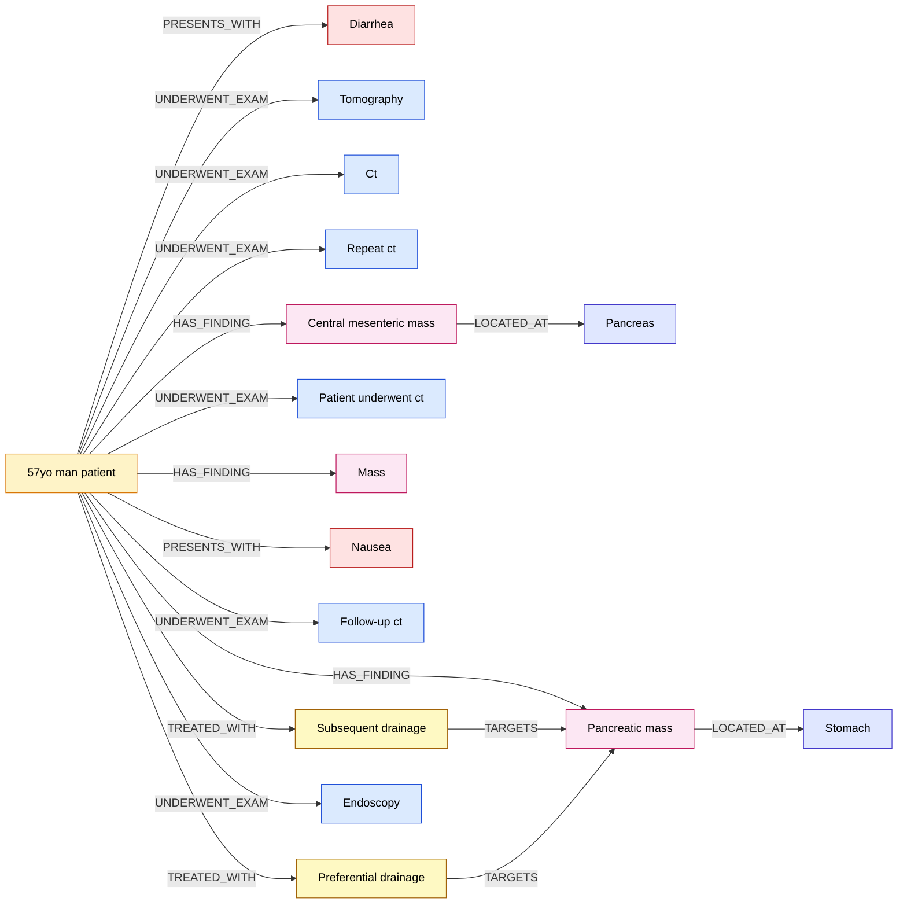

```mermaid
flowchart LR
  classDef patient fill:#fef3c7,stroke:#d97706,color:#000
  classDef symptom fill:#fee2e2,stroke:#b91c1c,color:#000
  classDef finding fill:#fce7f3,stroke:#be185d,color:#000
  classDef exam fill:#dbeafe,stroke:#1d4ed8,color:#000
  classDef examresult fill:#cffafe,stroke:#0e7490,color:#000
  classDef anatomy fill:#e0e7ff,stroke:#4338ca,color:#000
  classDef diagnosis fill:#dcfce7,stroke:#15803d,color:#000
  classDef treatment fill:#fef9c3,stroke:#a16207,color:#000
  classDef outcome fill:#f3e8ff,stroke:#7e22ce,color:#000

  P1["57yo man patient"]:::patient
  S1["Diarrhea"]:::symptom
  E1["Tomography"]:::exam
  E2["Ct"]:::exam
  E3["Repeat ct"]:::exam
  F1["Central mesenteric mass"]:::finding
  A1["Pancreas"]:::anatomy
  E4["Patient underwent ct"]:::exam
  F2["Mass"]:::finding
  S2["Nausea"]:::symptom
  F3["Pancreatic mass"]:::finding
  E5["Follow-up ct"]:::exam
  A2["Stomach"]:::anatomy
  T1["Subsequent drainage"]:::treatment
  T2["Preferential drainage"]:::treatment
  E6["Endoscopy"]:::exam

  P1 -->|PRESENTS_WITH| S1
  P1 -->|UNDERWENT_EXAM| E1
  P1 -->|UNDERWENT_EXAM| E2
  P1 -->|UNDERWENT_EXAM| E3
  P1 -->|HAS_FINDING| F1
  P1 -->|UNDERWENT_EXAM| E4
  P1 -->|HAS_FINDING| F2
  P1 -->|PRESENTS_WITH| S2
  P1 -->|HAS_FINDING| F3
  P1 -->|UNDERWENT_EXAM| E5
  P1 -->|TREATED_WITH| T1
  P1 -->|TREATED_WITH| T2
  P1 -->|UNDERWENT_EXAM| E6
  F1 -->|LOCATED_AT| A1
  F3 -->|LOCATED_AT| A2
  T1 -->|TARGETS| F3
  T2 -->|TARGETS| F3
```