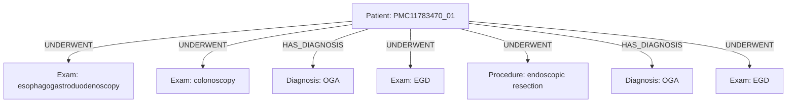
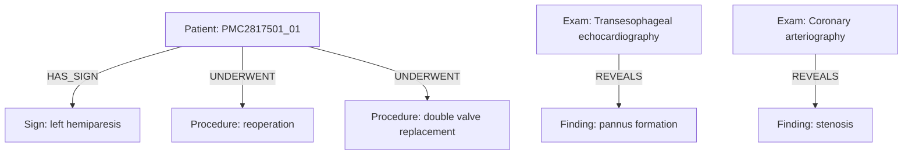

# Knowledge Graphs

Os diagramas abaixo representam os nodes e edges gerados pelo pipeline.

## PMC5137649_01

```mermaid
flowchart TD
    PMC5137649_01_PATIENT["Patient: PMC5137649_01"]
    PMC5137649_01_C0001["Symptom: lower quadrant abdominal pain"]
    PMC5137649_01_C0002["Symptom: nausea"]
    PMC5137649_01_C0003["Symptom: constipation"]
    PMC5137649_01_C0005["Exam: contrast enhanced computed tomography"]
    PMC5137649_01_C0006["Finding: cystic lesion"]
    PMC5137649_01_C0009["Exam: EUS-FNA"]
    PMC5137649_01_C0010["Finding: normal pancreatic echotexture"]
    PMC5137649_01_C0011["Finding: cyst"]
    PMC5137649_01_C0012["Finding: internal septations"]
    PMC5137649_01_C0013["Finding: associated masses"]
    PMC5137649_01_C0019["Diagnosis: mucinous pancreatic cystic neoplasm"]
    PMC5137649_01_C0040["Exam: oesophagogastroduodenoscopy"]
    PMC5137649_01_C0042["Finding: bleeding"]
    PMC5137649_01_C0043["Finding: leak"]
    PMC5137649_01_C0044["Exam: Final pathology"]
    PMC5137649_01_C0045["Finding: cyst"]
    PMC5137649_01_C0046["Finding: cyst"]
    PMC5137649_01_C0047["Diagnosis: GDC"]
    PMC5137649_01_PATIENT -->|HAS_SYMPTOM| PMC5137649_01_C0001
    PMC5137649_01_PATIENT -->|HAS_SYMPTOM| PMC5137649_01_C0002
    PMC5137649_01_PATIENT -->|HAS_SYMPTOM| PMC5137649_01_C0003
    PMC5137649_01_PATIENT -->|UNDERWENT| PMC5137649_01_C0005
    PMC5137649_01_C0005 -->|REVEALS| PMC5137649_01_C0006
    PMC5137649_01_PATIENT -->|UNDERWENT| PMC5137649_01_C0009
    PMC5137649_01_C0009 -->|REVEALS| PMC5137649_01_C0010
    PMC5137649_01_C0009 -->|REVEALS| PMC5137649_01_C0011
    PMC5137649_01_C0009 -->|REVEALS| PMC5137649_01_C0012
    PMC5137649_01_C0009 -->|REVEALS| PMC5137649_01_C0013
    PMC5137649_01_PATIENT -->|HAS_DIAGNOSIS| PMC5137649_01_C0019
    PMC5137649_01_C0040 -->|REVEALS| PMC5137649_01_C0042
    PMC5137649_01_C0040 -->|REVEALS| PMC5137649_01_C0043
    PMC5137649_01_C0044 -->|REVEALS| PMC5137649_01_C0045
    PMC5137649_01_C0044 -->|REVEALS| PMC5137649_01_C0046
    PMC5137649_01_PATIENT -->|HAS_DIAGNOSIS| PMC5137649_01_C0047
```

## PMC11722600_01

```mermaid
flowchart TD
    PMC11722600_01_PATIENT["Patient: PMC11722600_01"]
    PMC11722600_01_C0001["Procedure: cesarean section"]
    PMC11722600_01_C0002["Symptom: continuous abdominal pain"]
    PMC11722600_01_C0011["Sign: localized tenderness"]
    PMC11722600_01_C0013["Sign: rebound tenderness"]
    PMC11722600_01_C0014["Sign: McBurney's point"]
    PMC11722600_01_C0015["Sign: obturator sign"]
    PMC11722600_01_C0016["Exam: ultrasound"]
    PMC11722600_01_C0017["Finding: free fluid"]
    PMC11722600_01_C0019["Exam: CT"]
    PMC11722600_01_C0020["Finding: enlarged cecal appendix"]
    PMC11722600_01_C0021["Finding: inflammatory changes"]
    PMC11722600_01_C0022["Finding: enlarged right ovary"]
    PMC11722600_01_C0028["Procedure: laparoscopic appendectomy"]
    PMC11722600_01_C0042["Exam: histology"]
    PMC11722600_01_C0043["Finding: endometrial glands"]
    PMC11722600_01_PATIENT -->|HAS_SYMPTOM| PMC11722600_01_C0002
    PMC11722600_01_PATIENT -->|HAS_HISTORY| PMC11722600_01_C0001
    PMC11722600_01_PATIENT -->|HAS_SIGN| PMC11722600_01_C0011
    PMC11722600_01_PATIENT -->|HAS_SIGN| PMC11722600_01_C0013
    PMC11722600_01_PATIENT -->|HAS_SIGN| PMC11722600_01_C0014
    PMC11722600_01_PATIENT -->|HAS_SIGN| PMC11722600_01_C0015
    PMC11722600_01_C0016 -->|REVEALS| PMC11722600_01_C0017
    PMC11722600_01_C0019 -->|REVEALS| PMC11722600_01_C0020
    PMC11722600_01_C0019 -->|REVEALS| PMC11722600_01_C0021
    PMC11722600_01_C0019 -->|REVEALS| PMC11722600_01_C0022
    PMC11722600_01_PATIENT -->|UNDERWENT| PMC11722600_01_C0028
    PMC11722600_01_C0042 -->|REVEALS| PMC11722600_01_C0043
```

## PMC11783470_01

```mermaid
flowchart TD
    PMC11783470_01_PATIENT["Patient: PMC11783470_01"]
    PMC11783470_01_C0017["Exam: esophagogastroduodenoscopy"]
    PMC11783470_01_C0018["Exam: colonoscopy"]
    PMC11783470_01_C0024["Diagnosis: OGA"]
    PMC11783470_01_C0029["Exam: EGD"]
    PMC11783470_01_C0030["Procedure: endoscopic resection"]
    PMC11783470_01_C0031["Diagnosis: OGA"]
    PMC11783470_01_C0035["Exam: EGD"]
    PMC11783470_01_PATIENT -->|UNDERWENT| PMC11783470_01_C0017
    PMC11783470_01_PATIENT -->|UNDERWENT| PMC11783470_01_C0018
    PMC11783470_01_PATIENT -->|HAS_DIAGNOSIS| PMC11783470_01_C0024
    PMC11783470_01_PATIENT -->|UNDERWENT| PMC11783470_01_C0029
    PMC11783470_01_PATIENT -->|UNDERWENT| PMC11783470_01_C0030
    PMC11783470_01_PATIENT -->|HAS_DIAGNOSIS| PMC11783470_01_C0031
    PMC11783470_01_PATIENT -->|UNDERWENT| PMC11783470_01_C0035
```

## PMC2817501_01

```mermaid
flowchart TD
    PMC2817501_01_PATIENT["Patient: PMC2817501_01"]
    PMC2817501_01_C0005["Sign: left hemiparesis"]
    PMC2817501_01_C0009["Exam: Transesophageal echocardiography"]
    PMC2817501_01_C0012["Finding: pannus formation"]
    PMC2817501_01_C0013["Exam: Coronary arteriography"]
    PMC2817501_01_C0014["Finding: stenosis"]
    PMC2817501_01_C0016["Procedure: reoperation"]
    PMC2817501_01_C0017["Procedure: double valve replacement"]
    PMC2817501_01_PATIENT -->|HAS_SIGN| PMC2817501_01_C0005
    PMC2817501_01_C0009 -->|REVEALS| PMC2817501_01_C0012
    PMC2817501_01_C0013 -->|REVEALS| PMC2817501_01_C0014
    PMC2817501_01_PATIENT -->|UNDERWENT| PMC2817501_01_C0016
    PMC2817501_01_PATIENT -->|UNDERWENT| PMC2817501_01_C0017
```

## PMC11368112_01

```mermaid
flowchart TD
    PMC11368112_01_PATIENT["Patient: PMC11368112_01"]
    PMC11368112_01_C0003["Diagnosis: lower extremity venous thrombosis"]
    PMC11368112_01_C0004["Procedure: surgery"]
    PMC11368112_01_C0005["Diagnosis: hypertension"]
    PMC11368112_01_C0006["Symptom: dyspnea"]
    PMC11368112_01_C0007["Symptom: fever"]
    PMC11368112_01_C0008["Symptom: chills"]
    PMC11368112_01_C0010["Sign: rapid respiration"]
    PMC11368112_01_C0011["Exam: ultrasound"]
    PMC11368112_01_C0012["Finding: thrombosis"]
    PMC11368112_01_C0017["Exam: ECG"]
    PMC11368112_01_C0018["Finding: sinus tachycardia"]
    PMC11368112_01_C0019["Exam: CTA"]
    PMC11368112_01_C0020["Finding: embolism"]
    PMC11368112_01_C0023["Finding: exudative changes"]
    PMC11368112_01_C0026["Diagnosis: pulmonary embolism"]
    PMC11368112_01_C0031["Exam: esophageal echocardiogram"]
    PMC11368112_01_C0032["Finding: hyperechoic right atrium"]
    PMC11368112_01_C0033["Finding: widened coronary sinus"]
    PMC11368112_01_C0034["Procedure: surgery"]
    PMC11368112_01_C0041["Sign: ulcers"]
    PMC11368112_01_C0049["Procedure: skin biopsy"]
    PMC11368112_01_C0051["Diagnosis: BD"]
    PMC11368112_01_PATIENT -->|HAS_HISTORY| PMC11368112_01_C0003
    PMC11368112_01_PATIENT -->|HAS_HISTORY| PMC11368112_01_C0004
    PMC11368112_01_PATIENT -->|HAS_HISTORY| PMC11368112_01_C0005
    PMC11368112_01_PATIENT -->|HAS_SYMPTOM| PMC11368112_01_C0006
    PMC11368112_01_PATIENT -->|HAS_SYMPTOM| PMC11368112_01_C0007
    PMC11368112_01_PATIENT -->|HAS_SYMPTOM| PMC11368112_01_C0008
    PMC11368112_01_PATIENT -->|HAS_SIGN| PMC11368112_01_C0010
    PMC11368112_01_C0011 -->|REVEALS| PMC11368112_01_C0012
    PMC11368112_01_C0017 -->|REVEALS| PMC11368112_01_C0018
    PMC11368112_01_C0019 -->|REVEALS| PMC11368112_01_C0020
    PMC11368112_01_C0019 -->|REVEALS| PMC11368112_01_C0023
    PMC11368112_01_PATIENT -->|HAS_DIAGNOSIS| PMC11368112_01_C0026
    PMC11368112_01_C0031 -->|REVEALS| PMC11368112_01_C0032
    PMC11368112_01_C0031 -->|REVEALS| PMC11368112_01_C0033
    PMC11368112_01_PATIENT -->|UNDERWENT| PMC11368112_01_C0034
    PMC11368112_01_PATIENT -->|HAS_SIGN| PMC11368112_01_C0041
    PMC11368112_01_PATIENT -->|UNDERWENT| PMC11368112_01_C0049
    PMC11368112_01_PATIENT -->|HAS_DIAGNOSIS| PMC11368112_01_C0051
```
