# Caso PMC11368112_01

## Knowledge Graph

```mermaid
flowchart TD
    PMC11368112_01_PATIENT["Patient: PMC11368112_01"]
    PMC11368112_01_C0003["Diagnosis: lower extremity venous thrombosis"]
    PMC11368112_01_C0004["Procedure: surgery"]
    PMC11368112_01_C0005["Diagnosis: hypertension"]
    PMC11368112_01_C0006["Symptom: dyspnea"]
    PMC11368112_01_C0007["Symptom: fever"]
    PMC11368112_01_C0008["Symptom: chills"]
    PMC11368112_01_C0010["Sign: rapid respiration"]
    PMC11368112_01_C0011["Exam: ultrasound"]
    PMC11368112_01_C0012["Finding: thrombosis"]
    PMC11368112_01_C0017["Exam: ECG"]
    PMC11368112_01_C0018["Finding: sinus tachycardia"]
    PMC11368112_01_C0019["Exam: CTA"]
    PMC11368112_01_C0020["Finding: embolism"]
    PMC11368112_01_C0023["Finding: exudative changes"]
    PMC11368112_01_C0026["Diagnosis: pulmonary embolism"]
    PMC11368112_01_C0031["Exam: esophageal echocardiogram"]
    PMC11368112_01_C0032["Finding: hyperechoic right atrium"]
    PMC11368112_01_C0033["Finding: widened coronary sinus"]
    PMC11368112_01_C0034["Procedure: surgery"]
    PMC11368112_01_C0041["Sign: ulcers"]
    PMC11368112_01_C0049["Procedure: skin biopsy"]
    PMC11368112_01_C0051["Diagnosis: BD"]
    PMC11368112_01_PATIENT -->|HAS_HISTORY| PMC11368112_01_C0003
    PMC11368112_01_PATIENT -->|HAS_HISTORY| PMC11368112_01_C0004
    PMC11368112_01_PATIENT -->|HAS_HISTORY| PMC11368112_01_C0005
    PMC11368112_01_PATIENT -->|HAS_SYMPTOM| PMC11368112_01_C0006
    PMC11368112_01_PATIENT -->|HAS_SYMPTOM| PMC11368112_01_C0007
    PMC11368112_01_PATIENT -->|HAS_SYMPTOM| PMC11368112_01_C0008
    PMC11368112_01_PATIENT -->|HAS_SIGN| PMC11368112_01_C0010
    PMC11368112_01_C0011 -->|REVEALS| PMC11368112_01_C0012
    PMC11368112_01_C0017 -->|REVEALS| PMC11368112_01_C0018
    PMC11368112_01_C0019 -->|REVEALS| PMC11368112_01_C0020
    PMC11368112_01_C0019 -->|REVEALS| PMC11368112_01_C0023
    PMC11368112_01_PATIENT -->|HAS_DIAGNOSIS| PMC11368112_01_C0026
    PMC11368112_01_C0031 -->|REVEALS| PMC11368112_01_C0032
    PMC11368112_01_C0031 -->|REVEALS| PMC11368112_01_C0033
    PMC11368112_01_PATIENT -->|UNDERWENT| PMC11368112_01_C0034
    PMC11368112_01_PATIENT -->|HAS_SIGN| PMC11368112_01_C0041
    PMC11368112_01_PATIENT -->|UNDERWENT| PMC11368112_01_C0049
    PMC11368112_01_PATIENT -->|HAS_DIAGNOSIS| PMC11368112_01_C0051
```

## Tabela de nos

| entity_id | type | label | attributes |
|---|---|---|---|
| PMC11368112_01_PATIENT | Patient | case PMC11368112_01 | {} |
| PMC11368112_01_M0001 | Measurement | 38.7 C | {"measurement_type": "simple_measurement", "unit": "C", "value": 38.7} |
| PMC11368112_01_M0002 | Measurement | 12.65 × 10^9/L | {"base": 10, "coefficient": 12.65, "exponent": 9, "measurement_type": "scientific_notation", "normalization_rule": "normalize_degraded_scientific_notation_v1", "unit": "1/L", "value": 12650000000.0} |
| PMC11368112_01_M0003 | Measurement | 85 % | {"measurement_type": "percentage", "unit": "%", "value": 85} |
| PMC11368112_01_M0004 | Measurement | 65 mg/L | {"measurement_type": "simple_measurement", "unit": "mg/L", "value": 65} |
| PMC11368112_01_M0005 | Measurement | 55 mm/h | {"measurement_type": "simple_measurement", "unit": "mm/h", "value": 55} |
| PMC11368112_01_M0006 | Measurement | 26.12 mg/L | {"measurement_type": "simple_measurement", "unit": "mg/L", "value": 26.12} |
| PMC11368112_01_M0007 | Measurement | 39.5 C | {"measurement_type": "simple_measurement", "unit": "C", "value": 39.5} |
| PMC11368112_01_M0008 | Measurement | 39.8 C | {"measurement_type": "simple_measurement", "unit": "C", "value": 39.8} |
| PMC11368112_01_M0009 | Measurement | 3 cm x 3 cm | {"measurement_type": "dimension", "units": ["cm", "cm"], "values": [3, 3]} |
| PMC11368112_01_M0010 | Measurement | 0.2-0.8 cm | {"high": 0.8, "low": 0.2, "measurement_type": "range", "unit": "cm"} |
| PMC11368112_01_M0011 | Measurement | 80 mg/day | {"measurement_type": "simple_measurement", "unit": "mg/day", "value": 80} |
| PMC11368112_01_M0012 | Measurement | 60 mg/day | {"measurement_type": "simple_measurement", "unit": "mg/day", "value": 60} |
| PMC11368112_01_M0013 | Measurement | 5 mg | {"measurement_type": "simple_measurement", "unit": "mg", "value": 5} |
| PMC11368112_01_M0014 | Measurement | 5 mg | {"measurement_type": "simple_measurement", "unit": "mg", "value": 5} |
| PMC11368112_01_M0015 | Measurement | 200 mg/day | {"measurement_type": "simple_measurement", "unit": "mg/day", "value": 200} |
| PMC11368112_01_C0001 | Symptom | chest tightness | {"assertion": "present", "gazetteer_term": "chest tightness"} |
| PMC11368112_01_C0002 | Symptom | fever | {"assertion": "present", "gazetteer_term": "fever"} |
| PMC11368112_01_C0003 | Diagnosis | lower extremity venous thrombosis | {"assertion": "present", "certainty": "confirmed", "gazetteer_term": "lower extremity venous thrombosis"} |
| PMC11368112_01_C0004 | Procedure | surgery | {"assertion": "present", "gazetteer_term": "surgery"} |
| PMC11368112_01_C0005 | Diagnosis | hypertension | {"assertion": "present", "certainty": "confirmed", "gazetteer_term": "hypertension"} |
| PMC11368112_01_C0006 | Symptom | dyspnea | {"assertion": "present", "gazetteer_term": "dyspnea"} |
| PMC11368112_01_C0007 | Symptom | fever | {"assertion": "present", "gazetteer_term": "fever"} |
| PMC11368112_01_C0008 | Symptom | chills | {"assertion": "present", "gazetteer_term": "chills"} |
| PMC11368112_01_C0009 | Exam | physical examination | {"assertion": "present", "gazetteer_term": "physical examination"} |
| PMC11368112_01_C0010 | Sign | rapid respiration | {"assertion": "present", "gazetteer_term": "rapid respiration"} |
| PMC11368112_01_C0011 | Exam | ultrasound | {"assertion": "present", "gazetteer_term": "ultrasound"} |
| PMC11368112_01_C0012 | Finding | thrombosis | {"assertion": "present", "gazetteer_term": "thrombosis"} |
| PMC11368112_01_C0013 | AnatomicalSite | common femoral vein | {"assertion": "present", "gazetteer_term": "common femoral vein"} |
| PMC11368112_01_C0014 | AnatomicalSite | bilateral external iliac veins | {"assertion": "present", "gazetteer_term": "bilateral external iliac veins"} |
| PMC11368112_01_C0015 | AnatomicalSite | left superficial femoral vein | {"assertion": "present", "gazetteer_term": "left superficial femoral vein"} |
| PMC11368112_01_C0016 | AnatomicalSite | lower limbs | {"assertion": "present", "gazetteer_term": "lower limbs"} |
| PMC11368112_01_C0017 | Exam | electrocardiography | {"assertion": "present", "gazetteer_term": "ECG"} |
| PMC11368112_01_C0018 | Finding | sinus tachycardia | {"assertion": "present", "gazetteer_term": "sinus tachycardia"} |
| PMC11368112_01_C0019 | Exam | computed tomography angiography | {"assertion": "present", "gazetteer_term": "CTA"} |
| PMC11368112_01_C0020 | Finding | embolism | {"assertion": "present", "gazetteer_term": "embolism"} |
| PMC11368112_01_C0021 | AnatomicalSite | lower pulmonary artery branches | {"assertion": "present", "gazetteer_term": "lower pulmonary artery branches"} |
| PMC11368112_01_C0022 | AnatomicalSite | right lower pulmonary artery branch | {"assertion": "present", "gazetteer_term": "right lower pulmonary artery branch"} |
| PMC11368112_01_C0023 | Finding | exudative changes | {"assertion": "present", "gazetteer_term": "exudative changes"} |
| PMC11368112_01_C0024 | AnatomicalSite | lower lung lobes | {"assertion": "present", "gazetteer_term": "lower lobes"} |
| PMC11368112_01_C0025 | AnatomicalSite | lungs | {"assertion": "present", "gazetteer_term": "lungs"} |
| PMC11368112_01_C0026 | Diagnosis | pulmonary embolism | {"assertion": "present", "certainty": "confirmed", "gazetteer_term": "pulmonary embolism"} |
| PMC11368112_01_C0027 | Symptom | chills | {"assertion": "present", "gazetteer_term": "chills"} |
| PMC11368112_01_C0028 | Symptom | fever | {"assertion": "present", "gazetteer_term": "fever"} |
| PMC11368112_01_C0029 | Symptom | fever | {"assertion": "present", "gazetteer_term": "fever"} |
| PMC11368112_01_C0030 | Procedure | surgery | {"assertion": "present", "gazetteer_term": "surgery"} |
| PMC11368112_01_C0031 | Exam | transesophageal echocardiography | {"assertion": "present", "gazetteer_term": "esophageal echocardiogram"} |
| PMC11368112_01_C0032 | Finding | hyperechoic right atrium | {"assertion": "present", "gazetteer_term": "hyperechoic right atrium"} |
| PMC11368112_01_C0033 | Finding | widened coronary sinus | {"assertion": "present", "gazetteer_term": "widened coronary sinus"} |
| PMC11368112_01_C0034 | Procedure | surgery | {"assertion": "present", "gazetteer_term": "surgery"} |
| PMC11368112_01_C0035 | AnatomicalSite | coronary sinus | {"assertion": "present", "gazetteer_term": "coronary sinus"} |
| PMC11368112_01_C0036 | AnatomicalSite | right atrium | {"assertion": "present", "gazetteer_term": "right atrium"} |
| PMC11368112_01_C0037 | Procedure | surgery | {"assertion": "present", "gazetteer_term": "surgery"} |
| PMC11368112_01_C0038 | Diagnosis | tuberculosis | {"assertion": "present", "certainty": "suspected", "gazetteer_term": "tuberculosis"} |
| PMC11368112_01_C0039 | Diagnosis | fungal infection | {"assertion": "present", "certainty": "suspected", "gazetteer_term": "fungal infection"} |
| PMC11368112_01_C0040 | Exam | physical examination | {"assertion": "present", "gazetteer_term": "physical examination"} |
| PMC11368112_01_C0041 | Sign | ulcers | {"assertion": "present", "gazetteer_term": "ulcers"} |
| PMC11368112_01_C0042 | AnatomicalSite | lower extremities | {"assertion": "present", "gazetteer_term": "lower extremities"} |
| PMC11368112_01_C0043 | AnatomicalSite | groin | {"assertion": "present", "gazetteer_term": "groin"} |
| PMC11368112_01_C0044 | AnatomicalSite | scrotum | {"assertion": "present", "gazetteer_term": "scrotum"} |
| PMC11368112_01_C0045 | AnatomicalSite | oropharynx | {"assertion": "present", "gazetteer_term": "oropharynx"} |
| PMC11368112_01_C0046 | Sign | ulcers | {"assertion": "present", "gazetteer_term": "ulcers"} |
| PMC11368112_01_C0047 | AnatomicalSite | tongue | {"assertion": "present", "gazetteer_term": "tongue"} |
| PMC11368112_01_C0048 | AnatomicalSite | labium | {"assertion": "present", "gazetteer_term": "labium"} |
| PMC11368112_01_C0049 | Procedure | skin biopsy | {"assertion": "present", "gazetteer_term": "skin biopsy"} |
| PMC11368112_01_C0050 | Finding | epidermal ulceration | {"assertion": "present", "gazetteer_term": "epidermal ulceration"} |
| PMC11368112_01_C0051 | Diagnosis | Behcet's disease | {"assertion": "present", "certainty": "confirmed", "gazetteer_term": "BD"} |
| PMC11368112_01_C0052 | Procedure | surgery | {"assertion": "present", "gazetteer_term": "surgery"} |
| PMC11368112_01_C0053 | Procedure | surgery | {"assertion": "present", "gazetteer_term": "surgery"} |
| PMC11368112_01_C0054 | AnatomicalSite | pulmonary artery | {"assertion": "present", "gazetteer_term": "pulmonary artery"} |
| PMC11368112_01_C0055 | Exam | computed tomography angiography | {"assertion": "present", "gazetteer_term": "CTA"} |
| PMC11368112_01_C0056 | AnatomicalSite | right lower pulmonary artery branch | {"assertion": "present", "gazetteer_term": "right lower pulmonary branch"} |

## Tabela de arestas

| edge_id | source_id | target_id | relation | attributes |
|---|---|---|---|---|
| PMC11368112_01_E0001 | PMC11368112_01_PATIENT | PMC11368112_01_C0003 | HAS_HISTORY | {"assertion": "present"} |
| PMC11368112_01_E0002 | PMC11368112_01_PATIENT | PMC11368112_01_C0004 | HAS_HISTORY | {"assertion": "present"} |
| PMC11368112_01_E0003 | PMC11368112_01_PATIENT | PMC11368112_01_C0005 | HAS_HISTORY | {"assertion": "present"} |
| PMC11368112_01_E0004 | PMC11368112_01_PATIENT | PMC11368112_01_C0006 | HAS_SYMPTOM | {"assertion": "present"} |
| PMC11368112_01_E0005 | PMC11368112_01_PATIENT | PMC11368112_01_C0007 | HAS_SYMPTOM | {"assertion": "present"} |
| PMC11368112_01_E0006 | PMC11368112_01_PATIENT | PMC11368112_01_C0008 | HAS_SYMPTOM | {"assertion": "present"} |
| PMC11368112_01_E0007 | PMC11368112_01_PATIENT | PMC11368112_01_C0010 | HAS_SIGN | {"assertion": "present"} |
| PMC11368112_01_E0008 | PMC11368112_01_C0011 | PMC11368112_01_C0012 | REVEALS | {"assertion": "present"} |
| PMC11368112_01_E0009 | PMC11368112_01_C0017 | PMC11368112_01_C0018 | REVEALS | {"assertion": "present"} |
| PMC11368112_01_E0010 | PMC11368112_01_C0019 | PMC11368112_01_C0020 | REVEALS | {"assertion": "present"} |
| PMC11368112_01_E0011 | PMC11368112_01_C0019 | PMC11368112_01_C0023 | REVEALS | {"assertion": "present"} |
| PMC11368112_01_E0012 | PMC11368112_01_PATIENT | PMC11368112_01_C0026 | HAS_DIAGNOSIS | {"assertion": "present", "certainty": "confirmed"} |
| PMC11368112_01_E0013 | PMC11368112_01_C0031 | PMC11368112_01_C0032 | REVEALS | {"assertion": "present"} |
| PMC11368112_01_E0014 | PMC11368112_01_C0031 | PMC11368112_01_C0033 | REVEALS | {"assertion": "present"} |
| PMC11368112_01_E0015 | PMC11368112_01_PATIENT | PMC11368112_01_C0034 | UNDERWENT | {"assertion": "present"} |
| PMC11368112_01_E0016 | PMC11368112_01_PATIENT | PMC11368112_01_C0041 | HAS_SIGN | {"assertion": "present"} |
| PMC11368112_01_E0017 | PMC11368112_01_PATIENT | PMC11368112_01_C0049 | UNDERWENT | {"assertion": "present"} |
| PMC11368112_01_E0018 | PMC11368112_01_PATIENT | PMC11368112_01_C0051 | HAS_DIAGNOSIS | {"assertion": "present", "certainty": "confirmed"} |
