# Caso PMC11722600_01

## Knowledge Graph

```mermaid
flowchart TD
    PMC11722600_01_PATIENT["Patient: PMC11722600_01"]
    PMC11722600_01_C0001["Procedure: cesarean section"]
    PMC11722600_01_C0002["Symptom: continuous abdominal pain"]
    PMC11722600_01_C0011["Sign: localized tenderness"]
    PMC11722600_01_C0013["Sign: rebound tenderness"]
    PMC11722600_01_C0014["Sign: McBurney's point"]
    PMC11722600_01_C0015["Sign: obturator sign"]
    PMC11722600_01_C0016["Exam: ultrasound"]
    PMC11722600_01_C0017["Finding: free fluid"]
    PMC11722600_01_C0019["Exam: CT"]
    PMC11722600_01_C0020["Finding: enlarged cecal appendix"]
    PMC11722600_01_C0021["Finding: inflammatory changes"]
    PMC11722600_01_C0022["Finding: enlarged right ovary"]
    PMC11722600_01_C0028["Procedure: laparoscopic appendectomy"]
    PMC11722600_01_C0042["Exam: histology"]
    PMC11722600_01_C0043["Finding: endometrial glands"]
    PMC11722600_01_PATIENT -->|HAS_SYMPTOM| PMC11722600_01_C0002
    PMC11722600_01_PATIENT -->|HAS_HISTORY| PMC11722600_01_C0001
    PMC11722600_01_PATIENT -->|HAS_SIGN| PMC11722600_01_C0011
    PMC11722600_01_PATIENT -->|HAS_SIGN| PMC11722600_01_C0013
    PMC11722600_01_PATIENT -->|HAS_SIGN| PMC11722600_01_C0014
    PMC11722600_01_PATIENT -->|HAS_SIGN| PMC11722600_01_C0015
    PMC11722600_01_C0016 -->|REVEALS| PMC11722600_01_C0017
    PMC11722600_01_C0019 -->|REVEALS| PMC11722600_01_C0020
    PMC11722600_01_C0019 -->|REVEALS| PMC11722600_01_C0021
    PMC11722600_01_C0019 -->|REVEALS| PMC11722600_01_C0022
    PMC11722600_01_PATIENT -->|UNDERWENT| PMC11722600_01_C0028
    PMC11722600_01_C0042 -->|REVEALS| PMC11722600_01_C0043
```

## Tabela de nos

| entity_id | type | label | attributes |
|---|---|---|---|
| PMC11722600_01_PATIENT | Patient | case PMC11722600_01 | {} |
| PMC11722600_01_M0001 | Measurement | 8800 /mm3 | {"measurement_type": "simple_measurement", "unit": "/mm3", "value": 8800} |
| PMC11722600_01_M0002 | Measurement | 3800-10000 /mm3 | {"high": 10000, "low": 3800, "measurement_type": "range", "unit": "/mm3"} |
| PMC11722600_01_M0003 | Measurement | 55 mg/L | {"measurement_type": "simple_measurement", "unit": "mg/L", "value": 55} |
| PMC11722600_01_M0004 | Measurement | <5 mg/L | {"comparator": "<", "measurement_type": "simple_measurement", "unit": "mg/L", "value": 5} |
| PMC11722600_01_M0005 | Measurement | 29 mm/h | {"measurement_type": "simple_measurement", "unit": "mm/h", "value": 29} |
| PMC11722600_01_M0006 | Measurement | 3-20 mm/h | {"high": 20, "low": 3, "measurement_type": "range", "unit": "mm/h"} |
| PMC11722600_01_M0007 | Measurement | 8 mm | {"measurement_type": "simple_measurement", "unit": "mm", "value": 8} |
| PMC11722600_01_M0008 | Measurement | 4 cm | {"measurement_type": "simple_measurement", "unit": "cm", "value": 4} |
| PMC11722600_01_C0001 | Procedure | cesarean section | {"assertion": "present", "gazetteer_term": "cesarean section"} |
| PMC11722600_01_C0002 | Symptom | abdominal pain | {"assertion": "present", "gazetteer_term": "continuous abdominal pain"} |
| PMC11722600_01_C0003 | AnatomicalSite | right iliac fossa | {"assertion": "present", "gazetteer_term": "right iliac fossa"} |
| PMC11722600_01_C0004 | Symptom | fever | {"assertion": "negated", "gazetteer_term": "fever"} |
| PMC11722600_01_C0005 | Symptom | genitourinary symptoms | {"assertion": "negated", "gazetteer_term": "genitourinary symptoms"} |
| PMC11722600_01_C0006 | Symptom | dysmenorrhea | {"assertion": "negated", "gazetteer_term": "dysmenorrhea"} |
| PMC11722600_01_C0007 | Symptom | cyclical pelvic pain | {"assertion": "negated", "gazetteer_term": "cyclical pelvic pain"} |
| PMC11722600_01_C0008 | Exam | physical examination | {"assertion": "present", "gazetteer_term": "physical examination"} |
| PMC11722600_01_C0009 | Symptom | abdominal pain | {"assertion": "present", "gazetteer_term": "abdominal pain"} |
| PMC11722600_01_C0010 | AnatomicalSite | right iliac fossa | {"assertion": "present", "gazetteer_term": "RIF"} |
| PMC11722600_01_C0011 | Sign | localized tenderness | {"assertion": "present", "gazetteer_term": "localized tenderness"} |
| PMC11722600_01_C0012 | AnatomicalSite | right iliac fossa | {"assertion": "present", "gazetteer_term": "RIF"} |
| PMC11722600_01_C0013 | Sign | rebound tenderness | {"assertion": "negated", "gazetteer_term": "rebound tenderness"} |
| PMC11722600_01_C0014 | Sign | McBurney's point | {"assertion": "present", "gazetteer_term": "McBurney's point"} |
| PMC11722600_01_C0015 | Sign | obturator sign | {"assertion": "negated", "gazetteer_term": "obturator sign"} |
| PMC11722600_01_C0016 | Exam | ultrasound | {"assertion": "present", "gazetteer_term": "ultrasound"} |
| PMC11722600_01_C0017 | Finding | free fluid | {"assertion": "present", "gazetteer_term": "free fluid"} |
| PMC11722600_01_C0018 | AnatomicalSite | pouch of Douglas | {"assertion": "present", "gazetteer_term": "Pouch of Douglas"} |
| PMC11722600_01_C0019 | Exam | computed tomography | {"assertion": "present", "gazetteer_term": "CT"} |
| PMC11722600_01_C0020 | Finding | enlarged cecal appendix | {"assertion": "present", "gazetteer_term": "enlarged cecal appendix"} |
| PMC11722600_01_C0021 | Finding | inflammatory changes | {"assertion": "present", "gazetteer_term": "inflammatory changes"} |
| PMC11722600_01_C0022 | Finding | enlarged right ovary | {"assertion": "present", "gazetteer_term": "enlarged right ovary"} |
| PMC11722600_01_C0023 | Procedure | laparoscopic exploration | {"assertion": "present", "gazetteer_term": "laparoscopic exploration"} |
| PMC11722600_01_C0024 | Diagnosis | phlegmonous appendicitis | {"assertion": "present", "certainty": "confirmed", "gazetteer_term": "phlegmonous appendicitis"} |
| PMC11722600_01_C0025 | AnatomicalSite | appendix | {"assertion": "present", "gazetteer_term": "appendix"} |
| PMC11722600_01_C0026 | Finding | inflammatory congestion | {"assertion": "present", "gazetteer_term": "inflammatory congestion"} |
| PMC11722600_01_C0027 | AnatomicalSite | right fallopian tube | {"assertion": "present", "gazetteer_term": "right fallopian tube"} |
| PMC11722600_01_C0028 | Procedure | appendectomy | {"assertion": "present", "gazetteer_term": "laparoscopic appendectomy"} |
| PMC11722600_01_C0029 | Procedure | salpingectomy | {"assertion": "present", "gazetteer_term": "salpingectomy"} |
| PMC11722600_01_C0030 | Diagnosis | endometriosis | {"assertion": "negated", "certainty": "confirmed", "gazetteer_term": "endometriosis"} |
| PMC11722600_01_C0031 | Exam | histopathology | {"assertion": "present", "gazetteer_term": "histopathology"} |
| PMC11722600_01_C0032 | AnatomicalSite | appendix | {"assertion": "present", "gazetteer_term": "appendix"} |
| PMC11722600_01_C0033 | Finding | endometrial stroma | {"assertion": "present", "gazetteer_term": "endometrial stroma"} |
| PMC11722600_01_C0034 | AnatomicalSite | muscularis layer | {"assertion": "present", "gazetteer_term": "muscularis layer"} |
| PMC11722600_01_C0035 | AnatomicalSite | appendix | {"assertion": "present", "gazetteer_term": "appendix"} |
| PMC11722600_01_C0036 | Diagnosis | endometriosis | {"assertion": "present", "certainty": "confirmed", "gazetteer_term": "endometriosis"} |
| PMC11722600_01_C0037 | Finding | bleeding | {"assertion": "present", "gazetteer_term": "bleeding"} |
| PMC11722600_01_C0038 | Finding | endometrial glands | {"assertion": "present", "gazetteer_term": "endometrial glands"} |
| PMC11722600_01_C0039 | Finding | endometrial stroma | {"assertion": "present", "gazetteer_term": "endometrial stroma"} |
| PMC11722600_01_C0040 | AnatomicalSite | muscular layer | {"assertion": "present", "gazetteer_term": "muscular layer"} |
| PMC11722600_01_C0041 | AnatomicalSite | fallopian tube | {"assertion": "present", "gazetteer_term": "fallopian tube"} |
| PMC11722600_01_C0042 | Exam | histopathology | {"assertion": "present", "gazetteer_term": "histology"} |
| PMC11722600_01_C0043 | Finding | endometrial glands | {"assertion": "present", "gazetteer_term": "endometrial glands"} |
| PMC11722600_01_C0044 | Diagnosis | malignancy | {"assertion": "negated", "certainty": "confirmed", "gazetteer_term": "malignancy"} |

## Tabela de arestas

| edge_id | source_id | target_id | relation | attributes |
|---|---|---|---|---|
| PMC11722600_01_E0001 | PMC11722600_01_PATIENT | PMC11722600_01_C0002 | HAS_SYMPTOM | {"assertion": "present"} |
| PMC11722600_01_E0002 | PMC11722600_01_PATIENT | PMC11722600_01_C0001 | HAS_HISTORY | {"assertion": "present"} |
| PMC11722600_01_E0003 | PMC11722600_01_PATIENT | PMC11722600_01_C0011 | HAS_SIGN | {"assertion": "present"} |
| PMC11722600_01_E0004 | PMC11722600_01_PATIENT | PMC11722600_01_C0013 | HAS_SIGN | {"assertion": "negated"} |
| PMC11722600_01_E0005 | PMC11722600_01_PATIENT | PMC11722600_01_C0014 | HAS_SIGN | {"assertion": "present"} |
| PMC11722600_01_E0006 | PMC11722600_01_PATIENT | PMC11722600_01_C0015 | HAS_SIGN | {"assertion": "negated"} |
| PMC11722600_01_E0007 | PMC11722600_01_C0016 | PMC11722600_01_C0017 | REVEALS | {"assertion": "present"} |
| PMC11722600_01_E0008 | PMC11722600_01_C0019 | PMC11722600_01_C0020 | REVEALS | {"assertion": "present"} |
| PMC11722600_01_E0009 | PMC11722600_01_C0019 | PMC11722600_01_C0021 | REVEALS | {"assertion": "present"} |
| PMC11722600_01_E0010 | PMC11722600_01_C0019 | PMC11722600_01_C0022 | REVEALS | {"assertion": "present"} |
| PMC11722600_01_E0011 | PMC11722600_01_PATIENT | PMC11722600_01_C0028 | UNDERWENT | {"assertion": "present"} |
| PMC11722600_01_E0012 | PMC11722600_01_C0042 | PMC11722600_01_C0043 | REVEALS | {"assertion": "present"} |
