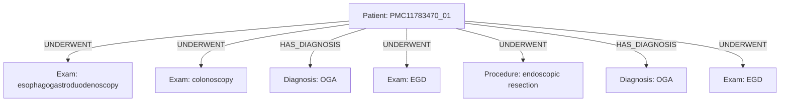

# Caso PMC11783470_01

## Knowledge Graph

## Tabela de nos

| entity_id | type | label | attributes |
|---|---|---|---|
| PMC11783470_01_PATIENT | Patient | case PMC11783470_01 | {} |
| PMC11783470_01_M0001 | Measurement | 11.5 g/dL | {"measurement_type": "simple_measurement", "unit": "g/dL", "value": 11.5} |
| PMC11783470_01_M0002 | Measurement | 12.8 % | {"measurement_type": "percentage", "unit": "%", "value": 12.8} |
| PMC11783470_01_M0003 | Measurement | 200 ng/mL | {"measurement_type": "simple_measurement", "unit": "ng/mL", "value": 200} |
| PMC11783470_01_M0004 | Measurement | 76 mcg/dL | {"measurement_type": "simple_measurement", "unit": "mcg/dL", "value": 76} |
| PMC11783470_01_M0005 | Measurement | <20 % | {"comparator": "<", "measurement_type": "percentage", "unit": "%", "value": 20} |
| PMC11783470_01_M0006 | Measurement | 7 mm | {"measurement_type": "simple_measurement", "unit": "mm", "value": 7} |
| PMC11783470_01_C0001 | Diagnosis | iron deficiency anemia | {"assertion": "present", "certainty": "confirmed", "gazetteer_term": "IDA"} |
| PMC11783470_01_C0002 | Symptom | menorrhagia | {"assertion": "negated", "gazetteer_term": "menorrhagia"} |
| PMC11783470_01_C0003 | Diagnosis | gastrointestinal malignancy | {"assertion": "negated", "certainty": "confirmed", "gazetteer_term": "gastrointestinal malignancy"} |
| PMC11783470_01_C0004 | Symptom | dysphagia | {"assertion": "negated", "gazetteer_term": "dysphagia"} |
| PMC11783470_01_C0005 | Symptom | odynophagia | {"assertion": "negated", "gazetteer_term": "odynophagia"} |
| PMC11783470_01_C0006 | Symptom | heartburn | {"assertion": "negated", "gazetteer_term": "heartburn"} |
| PMC11783470_01_C0007 | Symptom | nausea | {"assertion": "negated", "gazetteer_term": "nausea"} |
| PMC11783470_01_C0008 | Symptom | vomiting | {"assertion": "negated", "gazetteer_term": "vomiting"} |
| PMC11783470_01_C0009 | Symptom | abdominal pain | {"assertion": "negated", "gazetteer_term": "abdominal pain"} |
| PMC11783470_01_C0010 | Symptom | altered bowel habits | {"assertion": "negated", "gazetteer_term": "altered bowel habits"} |
| PMC11783470_01_C0011 | Symptom | melena | {"assertion": "negated", "gazetteer_term": "melena"} |
| PMC11783470_01_C0012 | Symptom | hematochezia | {"assertion": "negated", "gazetteer_term": "hematochezia"} |
| PMC11783470_01_C0013 | Symptom | unintentional weight loss | {"assertion": "negated", "gazetteer_term": "unintentional weight loss"} |
| PMC11783470_01_C0014 | Exam | physical examination | {"assertion": "present", "gazetteer_term": "physical examination"} |
| PMC11783470_01_C0015 | Sign | conjunctival pallor | {"assertion": "present", "gazetteer_term": "conjunctival pallor"} |
| PMC11783470_01_C0016 | Diagnosis | iron deficiency | {"assertion": "present", "certainty": "confirmed", "gazetteer_term": "iron deficiency"} |
| PMC11783470_01_C0017 | Exam | esophagogastroduodenoscopy | {"assertion": "present", "gazetteer_term": "esophagogastroduodenoscopy"} |
| PMC11783470_01_C0018 | Exam | colonoscopy | {"assertion": "present", "gazetteer_term": "colonoscopy"} |
| PMC11783470_01_C0019 | Diagnosis | iron deficiency anemia | {"assertion": "present", "certainty": "confirmed", "gazetteer_term": "IDA"} |
| PMC11783470_01_C0020 | Exam | esophagogastroduodenoscopy | {"assertion": "present", "gazetteer_term": "EGD"} |
| PMC11783470_01_C0021 | Procedure | biopsy | {"assertion": "present", "gazetteer_term": "biopsy"} |
| PMC11783470_01_C0022 | Procedure | biopsy | {"assertion": "present", "gazetteer_term": "biopsy"} |
| PMC11783470_01_C0023 | Finding | chief cell proliferation | {"assertion": "present", "gazetteer_term": "well-circumscribed proliferation of chief cells"} |
| PMC11783470_01_C0024 | Diagnosis | oxyntic gland adenoma | {"assertion": "present", "certainty": "confirmed", "gazetteer_term": "OGA"} |
| PMC11783470_01_C0025 | Diagnosis | celiac disease | {"assertion": "negated", "certainty": "confirmed", "gazetteer_term": "celiac disease"} |
| PMC11783470_01_C0026 | Exam | ileocolonoscopy | {"assertion": "present", "gazetteer_term": "ileocolonoscopy"} |
| PMC11783470_01_C0027 | Finding | bleeding source | {"assertion": "negated", "gazetteer_term": "bleeding source"} |
| PMC11783470_01_C0028 | Diagnosis | oxyntic gland adenoma | {"assertion": "present", "certainty": "confirmed", "gazetteer_term": "OGA"} |
| PMC11783470_01_C0029 | Exam | esophagogastroduodenoscopy | {"assertion": "present", "gazetteer_term": "EGD"} |
| PMC11783470_01_C0030 | Procedure | endoscopic resection | {"assertion": "present", "gazetteer_term": "endoscopic resection"} |
| PMC11783470_01_C0031 | Diagnosis | oxyntic gland adenoma | {"assertion": "present", "certainty": "confirmed", "gazetteer_term": "OGA"} |
| PMC11783470_01_C0032 | Symptom | menorrhagia | {"assertion": "present", "gazetteer_term": "menorrhagia"} |
| PMC11783470_01_C0033 | Exam | endoscopy | {"assertion": "present", "gazetteer_term": "endoscopy"} |
| PMC11783470_01_C0034 | Exam | endoscopy | {"assertion": "present", "gazetteer_term": "endoscopy"} |
| PMC11783470_01_C0035 | Exam | esophagogastroduodenoscopy | {"assertion": "present", "gazetteer_term": "EGD"} |
| PMC11783470_01_C0036 | Diagnosis | oxyntic gland adenoma | {"assertion": "negated", "certainty": "confirmed", "gazetteer_term": "OGA"} |

## Tabela de arestas

| edge_id | source_id | target_id | relation | attributes |
|---|---|---|---|---|
| PMC11783470_01_E0001 | PMC11783470_01_PATIENT | PMC11783470_01_C0017 | UNDERWENT | {"assertion": "present"} |
| PMC11783470_01_E0002 | PMC11783470_01_PATIENT | PMC11783470_01_C0018 | UNDERWENT | {"assertion": "present"} |
| PMC11783470_01_E0003 | PMC11783470_01_PATIENT | PMC11783470_01_C0024 | HAS_DIAGNOSIS | {"assertion": "present", "certainty": "confirmed"} |
| PMC11783470_01_E0004 | PMC11783470_01_PATIENT | PMC11783470_01_C0029 | UNDERWENT | {"assertion": "present"} |
| PMC11783470_01_E0005 | PMC11783470_01_PATIENT | PMC11783470_01_C0030 | UNDERWENT | {"assertion": "present"} |
| PMC11783470_01_E0006 | PMC11783470_01_PATIENT | PMC11783470_01_C0031 | HAS_DIAGNOSIS | {"assertion": "present", "certainty": "confirmed"} |
| PMC11783470_01_E0007 | PMC11783470_01_PATIENT | PMC11783470_01_C0035 | UNDERWENT | {"assertion": "present"} |
