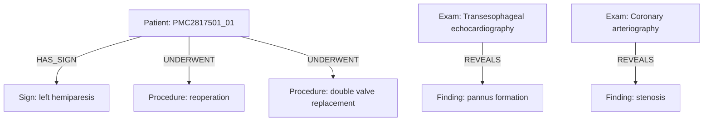

# Caso PMC2817501_01

## Knowledge Graph

## Tabela de nos

| entity_id | type | label | attributes |
|---|---|---|---|
| PMC2817501_01_PATIENT | Patient | case PMC2817501_01 | {} |
| PMC2817501_01_M0001 | Measurement | 120/80 mmHg | {"diastolic": 80, "measurement_type": "blood_pressure", "systolic": 120, "unit": "mmHg"} |
| PMC2817501_01_M0002 | Measurement | 92 beats/min | {"measurement_type": "simple_measurement", "unit": "beats/min", "value": 92} |
| PMC2817501_01_M0003 | Measurement | 30 mmHg | {"measurement_type": "simple_measurement", "unit": "mmHg", "value": 30} |
| PMC2817501_01_M0004 | Measurement | 20 mmHg | {"measurement_type": "simple_measurement", "unit": "mmHg", "value": 20} |
| PMC2817501_01_M0005 | Measurement | 1.8 cm2 | {"measurement_type": "simple_measurement", "unit": "cm2", "value": 1.8} |
| PMC2817501_01_M0006 | Measurement | 30 % | {"measurement_type": "percentage", "unit": "%", "value": 30} |
| PMC2817501_01_M0007 | Measurement | 68 mmHg | {"measurement_type": "simple_measurement", "unit": "mmHg", "value": 68} |
| PMC2817501_01_M0008 | Measurement | 90 % | {"measurement_type": "percentage", "unit": "%", "value": 90} |
| PMC2817501_01_M0009 | Measurement | 29 mm | {"measurement_type": "simple_measurement", "unit": "mm", "value": 29} |
| PMC2817501_01_M0010 | Measurement | 21 mm | {"measurement_type": "simple_measurement", "unit": "mm", "value": 21} |
| PMC2817501_01_C0001 | Symptom | dyspnea | {"assertion": "present", "gazetteer_term": "dyspnea"} |
| PMC2817501_01_C0002 | Symptom | angina | {"assertion": "present", "gazetteer_term": "angina"} |
| PMC2817501_01_C0003 | Procedure | aortic valve replacement | {"assertion": "present", "gazetteer_term": "aortic valve replacement"} |
| PMC2817501_01_C0004 | Exam | physical examination | {"assertion": "present", "gazetteer_term": "physical examination"} |
| PMC2817501_01_C0005 | Sign | left hemiparesis | {"assertion": "present", "gazetteer_term": "left hemiparesis"} |
| PMC2817501_01_C0006 | Sign | systolic murmur | {"assertion": "present", "gazetteer_term": "systolic murmur"} |
| PMC2817501_01_C0007 | Sign | rales | {"assertion": "present", "gazetteer_term": "rales"} |
| PMC2817501_01_C0008 | AnatomicalSite | lungs | {"assertion": "present", "gazetteer_term": "lungs"} |
| PMC2817501_01_C0009 | Exam | transesophageal echocardiography | {"assertion": "present", "gazetteer_term": "transesophageal echocardiography"} |
| PMC2817501_01_C0010 | Diagnosis | rheumatic mitral valve disease | {"assertion": "present", "certainty": "confirmed", "gazetteer_term": "rheumatic mitral valve disease"} |
| PMC2817501_01_C0011 | AnatomicalSite | pulmonary artery | {"assertion": "present", "gazetteer_term": "pulmonary artery"} |
| PMC2817501_01_C0012 | Finding | pannus formation | {"assertion": "present", "gazetteer_term": "pannus formation"} |
| PMC2817501_01_C0013 | Exam | coronary arteriography | {"assertion": "present", "gazetteer_term": "coronary arteriography"} |
| PMC2817501_01_C0014 | Finding | stenosis | {"assertion": "present", "gazetteer_term": "stenosis"} |
| PMC2817501_01_C0015 | AnatomicalSite | left anterior descending artery | {"assertion": "present", "gazetteer_term": "LAD"} |
| PMC2817501_01_C0016 | Procedure | reoperation | {"assertion": "present", "gazetteer_term": "reoperation"} |
| PMC2817501_01_C0017 | Procedure | double valve replacement | {"assertion": "present", "gazetteer_term": "double valve replacement"} |
| PMC2817501_01_C0018 | Procedure | reoperation | {"assertion": "present", "gazetteer_term": "reoperation"} |
| PMC2817501_01_C0019 | AnatomicalSite | mitral valve | {"assertion": "present", "gazetteer_term": "mitral valve"} |
| PMC2817501_01_C0020 | Procedure | aortotomy | {"assertion": "present", "gazetteer_term": "aortotomy"} |
| PMC2817501_01_C0021 | Finding | pannus formation | {"assertion": "present", "gazetteer_term": "pannus formation"} |
| PMC2817501_01_C0022 | Procedure | aortotomy | {"assertion": "present", "gazetteer_term": "aortotomy"} |
| PMC2817501_01_C0023 | Exam | echocardiography | {"assertion": "present", "gazetteer_term": "echocardiogram"} |

## Tabela de arestas

| edge_id | source_id | target_id | relation | attributes |
|---|---|---|---|---|
| PMC2817501_01_E0001 | PMC2817501_01_PATIENT | PMC2817501_01_C0005 | HAS_SIGN | {"assertion": "present"} |
| PMC2817501_01_E0002 | PMC2817501_01_C0009 | PMC2817501_01_C0012 | REVEALS | {"assertion": "present"} |
| PMC2817501_01_E0003 | PMC2817501_01_C0013 | PMC2817501_01_C0014 | REVEALS | {"assertion": "present"} |
| PMC2817501_01_E0004 | PMC2817501_01_PATIENT | PMC2817501_01_C0016 | UNDERWENT | {"assertion": "present"} |
| PMC2817501_01_E0005 | PMC2817501_01_PATIENT | PMC2817501_01_C0017 | UNDERWENT | {"assertion": "present"} |
