# Caso PMC5137649_01

## Knowledge Graph

```mermaid
flowchart TD
    PMC5137649_01_PATIENT["Patient: PMC5137649_01"]
    PMC5137649_01_C0001["Symptom: lower quadrant abdominal pain"]
    PMC5137649_01_C0002["Symptom: nausea"]
    PMC5137649_01_C0003["Symptom: constipation"]
    PMC5137649_01_C0005["Exam: contrast enhanced computed tomography"]
    PMC5137649_01_C0006["Finding: cystic lesion"]
    PMC5137649_01_C0009["Exam: EUS-FNA"]
    PMC5137649_01_C0010["Finding: normal pancreatic echotexture"]
    PMC5137649_01_C0011["Finding: cyst"]
    PMC5137649_01_C0012["Finding: internal septations"]
    PMC5137649_01_C0013["Finding: associated masses"]
    PMC5137649_01_C0019["Diagnosis: mucinous pancreatic cystic neoplasm"]
    PMC5137649_01_C0040["Exam: oesophagogastroduodenoscopy"]
    PMC5137649_01_C0042["Finding: bleeding"]
    PMC5137649_01_C0043["Finding: leak"]
    PMC5137649_01_C0044["Exam: Final pathology"]
    PMC5137649_01_C0045["Finding: cyst"]
    PMC5137649_01_C0046["Finding: cyst"]
    PMC5137649_01_C0047["Diagnosis: GDC"]
    PMC5137649_01_PATIENT -->|HAS_SYMPTOM| PMC5137649_01_C0001
    PMC5137649_01_PATIENT -->|HAS_SYMPTOM| PMC5137649_01_C0002
    PMC5137649_01_PATIENT -->|HAS_SYMPTOM| PMC5137649_01_C0003
    PMC5137649_01_PATIENT -->|UNDERWENT| PMC5137649_01_C0005
    PMC5137649_01_C0005 -->|REVEALS| PMC5137649_01_C0006
    PMC5137649_01_PATIENT -->|UNDERWENT| PMC5137649_01_C0009
    PMC5137649_01_C0009 -->|REVEALS| PMC5137649_01_C0010
    PMC5137649_01_C0009 -->|REVEALS| PMC5137649_01_C0011
    PMC5137649_01_C0009 -->|REVEALS| PMC5137649_01_C0012
    PMC5137649_01_C0009 -->|REVEALS| PMC5137649_01_C0013
    PMC5137649_01_PATIENT -->|HAS_DIAGNOSIS| PMC5137649_01_C0019
    PMC5137649_01_C0040 -->|REVEALS| PMC5137649_01_C0042
    PMC5137649_01_C0040 -->|REVEALS| PMC5137649_01_C0043
    PMC5137649_01_C0044 -->|REVEALS| PMC5137649_01_C0045
    PMC5137649_01_C0044 -->|REVEALS| PMC5137649_01_C0046
    PMC5137649_01_PATIENT -->|HAS_DIAGNOSIS| PMC5137649_01_C0047
```

## Tabela de nos

| entity_id | type | label | attributes |
|---|---|---|---|
| PMC5137649_01_PATIENT | Patient | case PMC5137649_01 | {} |
| PMC5137649_01_M0001 | Measurement | 6 cm | {"measurement_type": "simple_measurement", "unit": "cm", "value": 6} |
| PMC5137649_01_M0002 | Measurement | 6 cm x 9 cm | {"measurement_type": "dimension", "units": ["cm", "cm"], "values": [6, 9]} |
| PMC5137649_01_M0003 | Measurement | 12476.5 ng/mL | {"measurement_type": "simple_measurement", "unit": "ng/mL", "value": 12476.5} |
| PMC5137649_01_M0004 | Measurement | 6 IU/mL | {"measurement_type": "simple_measurement", "unit": "IU/mL", "value": 6} |
| PMC5137649_01_M0005 | Measurement | 9.5 cm x 4.5 cm x 2 cm | {"measurement_type": "dimension", "units": ["cm", "cm", "cm"], "values": [9.5, 4.5, 2]} |
| PMC5137649_01_C0001 | Symptom | lower quadrant abdominal pain | {"assertion": "present", "gazetteer_term": "lower quadrant abdominal pain"} |
| PMC5137649_01_C0002 | Symptom | nausea | {"assertion": "present", "gazetteer_term": "nausea"} |
| PMC5137649_01_C0003 | Symptom | constipation | {"assertion": "present", "gazetteer_term": "constipation"} |
| PMC5137649_01_C0004 | Exam | physical examination | {"assertion": "present", "gazetteer_term": "physical examination"} |
| PMC5137649_01_C0005 | Exam | computed tomography | {"assertion": "present", "gazetteer_term": "contrast enhanced computed tomography"} |
| PMC5137649_01_C0006 | Finding | cystic lesion | {"assertion": "present", "gazetteer_term": "cystic lesion"} |
| PMC5137649_01_C0007 | AnatomicalSite | stomach | {"assertion": "present", "gazetteer_term": "stomach"} |
| PMC5137649_01_C0008 | AnatomicalSite | pancreatic body/tail | {"assertion": "present", "gazetteer_term": "body/tail of the pancreas"} |
| PMC5137649_01_C0009 | Exam | endoscopic ultrasound-guided fine-needle aspiration | {"assertion": "present", "gazetteer_term": "EUS-FNA"} |
| PMC5137649_01_C0010 | Finding | normal pancreatic echotexture | {"assertion": "present", "gazetteer_term": "normal pancreatic echotexture"} |
| PMC5137649_01_C0011 | Finding | cyst | {"assertion": "present", "gazetteer_term": "cyst"} |
| PMC5137649_01_C0012 | Finding | internal septations | {"assertion": "negated", "gazetteer_term": "internal septations"} |
| PMC5137649_01_C0013 | Finding | associated masses | {"assertion": "negated", "gazetteer_term": "associated masses"} |
| PMC5137649_01_C0014 | AnatomicalSite | stomach | {"assertion": "present", "gazetteer_term": "stomach"} |
| PMC5137649_01_C0015 | Procedure | fine-needle aspiration | {"assertion": "present", "gazetteer_term": "FNA"} |
| PMC5137649_01_C0016 | Finding | cyst | {"assertion": "present", "gazetteer_term": "cyst"} |
| PMC5137649_01_C0017 | Diagnosis | malignancy | {"assertion": "negated", "certainty": "confirmed", "gazetteer_term": "malignancy"} |
| PMC5137649_01_C0018 | Finding | extracellular mucin | {"assertion": "present", "gazetteer_term": "extracellular mucin"} |
| PMC5137649_01_C0019 | Diagnosis | mucinous pancreatic cystic neoplasm | {"assertion": "present", "certainty": "suspected", "gazetteer_term": "mucinous pancreatic cystic neoplasm"} |
| PMC5137649_01_C0020 | Procedure | surgical resection | {"assertion": "present", "gazetteer_term": "surgical resection"} |
| PMC5137649_01_C0021 | Procedure | distal pancreatectomy | {"assertion": "present", "gazetteer_term": "laparoscopic distal pancreatectomy"} |
| PMC5137649_01_C0022 | Procedure | laparoscopic exploration | {"assertion": "present", "gazetteer_term": "laparoscopic exploration"} |
| PMC5137649_01_C0023 | AnatomicalSite | posterior wall of stomach | {"assertion": "present", "gazetteer_term": "posterior wall of the stomach"} |
| PMC5137649_01_C0024 | AnatomicalSite | stomach | {"assertion": "present", "gazetteer_term": "stomach"} |
| PMC5137649_01_C0025 | AnatomicalSite | pancreas | {"assertion": "present", "gazetteer_term": "pancreas"} |
| PMC5137649_01_C0026 | AnatomicalSite | pancreas | {"assertion": "present", "gazetteer_term": "pancreas"} |
| PMC5137649_01_C0027 | Finding | cyst | {"assertion": "present", "gazetteer_term": "cyst"} |
| PMC5137649_01_C0028 | AnatomicalSite | stomach | {"assertion": "present", "gazetteer_term": "stomach"} |
| PMC5137649_01_C0029 | Exam | endoscopy | {"assertion": "present", "gazetteer_term": "endoscopy"} |
| PMC5137649_01_C0030 | Finding | mucosal abnormalities | {"assertion": "negated", "gazetteer_term": "mucosal abnormalities"} |
| PMC5137649_01_C0031 | AnatomicalSite | stomach | {"assertion": "present", "gazetteer_term": "stomach"} |
| PMC5137649_01_C0032 | Finding | cyst | {"assertion": "present", "gazetteer_term": "cyst"} |
| PMC5137649_01_C0033 | AnatomicalSite | coeliac axis | {"assertion": "present", "gazetteer_term": "coeliac axis"} |
| PMC5137649_01_C0034 | Procedure | open resection | {"assertion": "present", "gazetteer_term": "open resection"} |
| PMC5137649_01_C0035 | AnatomicalSite | stomach | {"assertion": "present", "gazetteer_term": "stomach"} |
| PMC5137649_01_C0036 | Diagnosis | gastric duplication cyst | {"assertion": "present", "certainty": "confirmed", "gazetteer_term": "gastric duplication cyst"} |
| PMC5137649_01_C0037 | AnatomicalSite | coeliac vessels | {"assertion": "present", "gazetteer_term": "coeliac vessels"} |
| PMC5137649_01_C0038 | Finding | cyst | {"assertion": "present", "gazetteer_term": "cyst"} |
| PMC5137649_01_C0039 | AnatomicalSite | posterior wall of stomach | {"assertion": "present", "gazetteer_term": "posterior wall of the stomach"} |
| PMC5137649_01_C0040 | Exam | esophagogastroduodenoscopy | {"assertion": "present", "gazetteer_term": "oesophagogastroduodenoscopy"} |
| PMC5137649_01_C0041 | AnatomicalSite | posterior wall of stomach | {"assertion": "present", "gazetteer_term": "posterior stomach wall"} |
| PMC5137649_01_C0042 | Finding | bleeding | {"assertion": "negated", "gazetteer_term": "bleeding"} |
| PMC5137649_01_C0043 | Finding | leak | {"assertion": "negated", "gazetteer_term": "leak"} |
| PMC5137649_01_C0044 | Exam | histopathology | {"assertion": "present", "gazetteer_term": "final pathology"} |
| PMC5137649_01_C0045 | Finding | cyst | {"assertion": "present", "gazetteer_term": "cyst"} |
| PMC5137649_01_C0046 | Finding | cyst | {"assertion": "present", "gazetteer_term": "cyst"} |
| PMC5137649_01_C0047 | Diagnosis | gastric duplication cyst | {"assertion": "present", "certainty": "confirmed", "gazetteer_term": "GDC"} |
| PMC5137649_01_C0048 | Symptom | nausea | {"assertion": "present", "gazetteer_term": "nausea"} |

## Tabela de arestas

| edge_id | source_id | target_id | relation | attributes |
|---|---|---|---|---|
| PMC5137649_01_E0001 | PMC5137649_01_PATIENT | PMC5137649_01_C0001 | HAS_SYMPTOM | {"assertion": "present"} |
| PMC5137649_01_E0002 | PMC5137649_01_PATIENT | PMC5137649_01_C0002 | HAS_SYMPTOM | {"assertion": "present"} |
| PMC5137649_01_E0003 | PMC5137649_01_PATIENT | PMC5137649_01_C0003 | HAS_SYMPTOM | {"assertion": "present"} |
| PMC5137649_01_E0004 | PMC5137649_01_PATIENT | PMC5137649_01_C0005 | UNDERWENT | {"assertion": "present"} |
| PMC5137649_01_E0005 | PMC5137649_01_C0005 | PMC5137649_01_C0006 | REVEALS | {"assertion": "present"} |
| PMC5137649_01_E0006 | PMC5137649_01_PATIENT | PMC5137649_01_C0009 | UNDERWENT | {"assertion": "present"} |
| PMC5137649_01_E0007 | PMC5137649_01_C0009 | PMC5137649_01_C0010 | REVEALS | {"assertion": "present"} |
| PMC5137649_01_E0008 | PMC5137649_01_C0009 | PMC5137649_01_C0011 | REVEALS | {"assertion": "present"} |
| PMC5137649_01_E0009 | PMC5137649_01_C0009 | PMC5137649_01_C0012 | REVEALS | {"assertion": "negated"} |
| PMC5137649_01_E0010 | PMC5137649_01_C0009 | PMC5137649_01_C0013 | REVEALS | {"assertion": "negated"} |
| PMC5137649_01_E0011 | PMC5137649_01_PATIENT | PMC5137649_01_C0019 | HAS_DIAGNOSIS | {"assertion": "present", "certainty": "suspected"} |
| PMC5137649_01_E0012 | PMC5137649_01_C0040 | PMC5137649_01_C0042 | REVEALS | {"assertion": "negated"} |
| PMC5137649_01_E0013 | PMC5137649_01_C0040 | PMC5137649_01_C0043 | REVEALS | {"assertion": "negated"} |
| PMC5137649_01_E0014 | PMC5137649_01_C0044 | PMC5137649_01_C0045 | REVEALS | {"assertion": "present"} |
| PMC5137649_01_E0015 | PMC5137649_01_C0044 | PMC5137649_01_C0046 | REVEALS | {"assertion": "present"} |
| PMC5137649_01_E0016 | PMC5137649_01_PATIENT | PMC5137649_01_C0047 | HAS_DIAGNOSIS | {"assertion": "present", "certainty": "confirmed"} |
