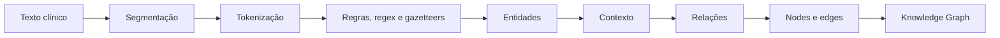

# Projeto 1 — Extração de informações clínicas para Knowledge Graphs

## Como executar o projeto

Os comandos devem ser executados na **raiz do repositório**, e não dentro da
pasta `project1`. O arquivo `main.py` da raiz não é utilizado.

1. Prepare o ambiente, na primeira execução, com `uv sync`.
2. Execute os testes com `.\.venv\Scripts\python.exe -m unittest discover -s project1/tests -v`.
3. Execute o pipeline com `.\.venv\Scripts\python.exe -m project1.run_project1`.
4. Consulte as saídas em `project1/results/output/`.

O ponto de entrada `run_project1.py` processa os cinco casos de desenvolvimento
definidos em `CASE_IDS`. A execução fechada dos 56 casos já está preservada em
`project1/results/iteration_2_all_cases/`, e os cinco grafos renderizados estão
em `project1/results/final_graph_candidates/`.

## 1. Objetivo do projeto

O projeto trabalha com casos clínicos do dataset MultiCaRe e busca transformar
texto clínico não estruturado em entidades, atributos e relações. Essas
informações são organizadas posteriormente como um Knowledge Graph. A extração
utiliza técnicas clássicas de Processamento de Línguas Naturais, sem LLMs ou
modelos Transformer.

Metodologicamente, a tarefa pertence à **Extração de Informação** (*Information
Extraction*), cujo objetivo é localizar informação estruturada dentro de textos.
Ela não deve ser confundida com Recuperação de Informação (*Information
Retrieval*), que se concentra em localizar documentos relevantes para uma
consulta.

## 2. Dataset e seleção inicial

A amostra utilizada contém 56 casos. `cases.csv` é a principal fonte textual,
`case_text` contém a narrativa clínica e `case_id` identifica cada caso. Os
campos `age`, `gender` e os metadados não foram tratados como referência clínica
automática, e o texto original foi sempre preservado.

As regras foram desenvolvidas inicialmente com cinco casos: `PMC5137649_01`,
`PMC11722600_01`, `PMC11783470_01`, `PMC2817501_01` e `PMC11368112_01`. Esse
recorte tornou possível observar os padrões em um conjunto pequeno e
compreensível. Depois do fechamento do pipeline, o mesmo método foi executado
sem alterações sobre os 56 casos para observar sua cobertura fora do conjunto
inicial.

## 3. Segmentação em sentenças

Cada `case_text` é dividido em sentenças, mantendo `sentence_id`, texto e offsets
em relação ao documento original. Essa etapa corresponde à segmentação de texto
(*sentence segmentation*).

Muitas relações clínicas são expressas localmente dentro de uma sentença.
Trabalhar nesse nível reduz o espaço de busca das regras e mantém uma ligação
direta entre a extração e sua evidência textual.

## 4. Tokenização

Cada sentença é dividida em tokens, preservando a posição de cada unidade. A
tokenização transforma o texto contínuo em elementos identificáveis que podem
ser examinados por regras, expressões regulares e outros padrões.

Trata-se de uma operação básica de NLP. Neste projeto ela foi adaptada para
formas clínicas como `EUS-FNA`, `C-reactive`, números decimais e unidades, sem
utilizar tokenizadores de modelos de linguagem.

## 5. Normalização

A normalização é controlada e não substitui o texto original. Para cada menção
são preservados `original_span`, offsets e `normalized_label`. Assim, `FNA`, por
exemplo, continua registrado como apareceu no texto e também pode ser
representado como `fine-needle aspiration`.

Essa decisão permite tratar formas equivalentes de modo consistente, sem perder
a rastreabilidade necessária para conferir a extração no documento de origem.

## 6. Gazetteers

O arquivo `gazetteers.json` organiza expressões das categorias `Symptom`,
`Sign`, `Exam`, `Finding`, `Diagnosis`, `Procedure` e `AnatomicalSite`. O
vocabulário foi formado por termos observados nos cinco casos de desenvolvimento
e por suas normalizações explícitas.

Um gazetteer é um recurso léxico usado em Extração de Informação para reconhecer
expressões conhecidas de categorias específicas. Essa abordagem torna o método
interpretável, reproduzível e auditável. Sua limitação é que a cobertura depende
diretamente do vocabulário registrado.

## 7. Expressões multipalavra e longest match

Quando duas entradas do gazetteer se sobrepõem, o sistema prioriza a expressão
mais longa. Desse modo, `abdominal pain` deve ser preferido a uma correspondência
parcial como `pain`.

Essa estratégia de *longest match* preserva expressões multipalavra (*multiword
expressions*), que são frequentes na linguagem clínica e podem perder parte de
seu significado quando divididas em entidades menores.

## 8. Extração de entidades

A tipificação transforma menções do texto em unidades estruturadas que podem se
tornar nós do grafo.

| Tipo | Função no projeto |
|---|---|
| `Patient` | Nó estrutural que representa o caso processado. |
| `Symptom` | Queixa ou experiência subjetiva do paciente. |
| `Sign` | Achado objetivo do exame físico. |
| `Exam` | Exame ou teste diagnóstico. |
| `Finding` | Achado produzido por exame, imagem, laboratório ou procedimento. |
| `Diagnosis` | Condição apresentada explicitamente como diagnóstico. |
| `Procedure` | Procedimento diagnóstico ou terapêutico. |
| `AnatomicalSite` | Estrutura ou localização anatômica. |
| `Measurement` | Valor acompanhado de unidade ou outra forma mensurável prevista. |

## 9. Measurements

Valores e unidades são extraídos principalmente por expressões regulares. Foram
considerados padrões como `6 cm`, `11.5 g/dL`, `12.8%` e dimensões como
`9.5 cm x 4.5 cm x 2.0 cm`.

Regex é apropriado nesse caso porque medições costumam apresentar uma estrutura
formal do tipo valor + unidade. O valor e a unidade são armazenados como
atributos de `Measurement`. O pipeline ainda não afirma que todas as medições
estejam vinculadas ao exame ou achado correto.

## 10. Temporal candidates

Expressões como `3 days`, `1.5 weeks`, `23.5 months` e `postoperative day 4` são
detectadas separadamente como `TemporalCandidate`.

Uma expressão temporal não representa necessariamente uma medição clínica.
Separá-la evita misturar conceitos semanticamente diferentes. Nesta versão, os
candidatos temporais são informação intermediária e não se tornam nós do
Knowledge Graph.

## 11. Reference range candidates

Sinais como `reference range` e `normal range` permitem marcar determinados
intervalos como `ReferenceRangeCandidate`, mantidos em uma saída intermediária.

Essa separação é necessária porque o valor observado descreve o paciente,
enquanto o intervalo de referência oferece contexto para interpretação. O
pipeline ainda não associa automaticamente esse intervalo a um exame.

## 12. Negação

A negação é detectada por regras com indicadores como `no`, `denied`,
`negative`, `no evidence of` e `did not show`. As entidades aplicáveis recebem
`assertion=present` ou `assertion=negated`.

Em texto clínico, ignorar esse contexto pode inverter o significado: `denied
fever` não indica presença de febre. O método utiliza escopo local e regras
explícitas, o que favorece a interpretação do resultado, mas pode ser limitado
em construções sintáticas mais complexas.

## 13. Certeza diagnóstica

Diagnósticos recebem `certainty=confirmed` ou `certainty=suspected`. Indicadores
como `suggesting`, `suspected` e `suspecting` sinalizam suspeita; na ausência
desses indicadores, a menção é mantida como confirmada pela regra atual.

Certeza e asserção são dimensões diferentes. `assertion` indica presença ou
negação da entidade, enquanto `certainty` representa o grau de confirmação do
diagnóstico.

## 14. Extração de relações

As relações são produzidas por gatilhos verbais e padrões linguísticos
explícitos. Os tipos implementados são:

| Relação | Estrutura e exemplo de padrão |
|---|---|
| `HAS_SYMPTOM` | Patient → Symptom; `presented with <Symptom>`. |
| `HAS_SIGN` | Patient → Sign; exame físico ou sinal positivo/negativo. |
| `HAS_HISTORY` | Patient → Diagnosis/Procedure; `history of <Condition>`. |
| `UNDERWENT` | Patient → Exam/Procedure; `underwent <Exam/Procedure>`. |
| `REVEALS` | Exam → Finding; `<Exam> showed/revealed <Finding>`. |
| `HAS_DIAGNOSIS` | Patient → Diagnosis; `diagnosed with <Diagnosis>`. |

Uma entidade isolada informa quais conceitos aparecem no texto. A relação
representa como eles estão semanticamente conectados e permite que o resultado
deixe de ser apenas uma lista de menções para assumir uma estrutura de grafo.

## 15. Por que não usar somente proximidade

Duas entidades próximas não necessariamente mantêm uma relação clínica. Por
isso, o pipeline não cria arestas apenas com base na distância textual; exige
verbos, padrões linguísticos e evidência explícita.

Essa escolha reduz relações espúrias e torna cada conexão explicável. Como
consequência, padrões não previstos deixam de gerar relações e a cobertura se
torna mais restrita.

## 16. Knowledge Graph

Cada execução produz `nodes.csv` e `edges.csv`. O primeiro armazena as entidades
e o segundo registra as relações por meio de `source_id`, `target_id` e tipo da
aresta. Todos os registros mantêm `case_id`.

No modelo de grafo, nós representam entidades e arestas representam relações.
O uso de `case_id` permite filtrar as duas tabelas e reconstruir separadamente o
grafo de cada caso clínico.

## 17. Rastreabilidade

As saídas preservam informações como `case_id`, `sentence_id`, `original_span`,
`start_char`, `end_char`, `rule_id` e, nas relações, a sentença em `evidence`.

Essa rastreabilidade permite verificar de onde veio uma extração e qual regra a
produziu. Em sistemas baseados em regras, isso favorece interpretabilidade,
reprodutibilidade, depuração e auditoria manual.

## 18. Visualização Mermaid

Os nós e as arestas de cada caso são convertidos em um arquivo Mermaid. Mermaid
não realiza extração: ele apenas oferece uma visualização do Knowledge Graph já
produzido.

As fontes de verdade continuam sendo `nodes.csv` e `edges.csv`. Para facilitar a
leitura, o Mermaid mostra somente os nós que participam de alguma relação. Essa
escolha é apenas visual: os nós isolados continuam preservados em `nodes.csv` e
nas tabelas Markdown. A execução também gera `graphs.md`, que reúne todos os
casos em blocos Mermaid para visualização direta em um leitor compatível. A
pasta `markdown/` contém um arquivo por caso com seu diagrama, sua tabela de nós
e sua tabela de arestas, seguindo a organização dos exemplos do projeto.

## 19. Execução sobre os 56 casos

O pipeline fechado foi aplicado aos 56 casos disponíveis. A execução padrão dos
cinco casos de desenvolvimento pode ser iniciada, a partir da raiz do
repositório, com `python -m project1.run_project1`; os resultados completos dos
56 casos estão preservados em `project1/results/iteration_2_all_cases/`.

| Resultado | Total |
|---|---:|
| Casos processados | 56 |
| Nós totais | 1.001 |
| Entidades clínicas | 572 |
| Measurements | 373 |
| Relações | 97 |
| Grafos Mermaid | 56 |

| Tipo clínico | Total | Relação | Total |
|---|---:|---|---:|
| Exam | 143 | REVEALS | 27 |
| AnatomicalSite | 96 | UNDERWENT | 26 |
| Procedure | 91 | HAS_SYMPTOM | 16 |
| Finding | 90 | HAS_DIAGNOSIS | 10 |
| Symptom | 81 | HAS_HISTORY | 9 |
| Diagnosis | 53 | HAS_SIGN | 9 |
| Sign | 18 | — | — |

Essas contagens descrevem a saída automática e não constituem uma medida de
exatidão.

## 20. Cobertura

A cobertura foi definida como uma medida operacional da quantidade de conteúdo
estruturado produzido. Ela não mede correção das extrações.

| Classe | Critério | Casos |
|---|---|---:|
| `BUENA` | Pelo menos 10 entidades clínicas e 2 relações. | 13 |
| `PARCIAL` | Não alcança BUENA, mas tem pelo menos 5 entidades ou 1 relação. | 17 |
| `MÍNIMA` | De 1 a 4 entidades e nenhuma relação. | 15 |
| `NULA` | Nenhuma entidade clínica. | 11 |

## 21. Limitações

- O gazetteer foi desenvolvido principalmente a partir de poucos casos
  iniciais, portanto sua cobertura depende desse vocabulário.
- Os padrões de relação são deliberadamente restritivos, e várias entidades não
  terminam conectadas por arestas.
- `Measurement` e `AnatomicalSite` podem permanecer isolados porque não possuem
  vinculação completa nesta versão.
- Onze casos não têm entidades clínicas reconhecidas e 32 não têm relações.
- Coortes, fragmentos e casos com vários pacientes são difíceis de representar
  com um único nó `Patient` por `case_id`.
- A abordagem baseada em regras oferece boa interpretabilidade, mas menor
  flexibilidade diante de vocabulário e construções não previstos.

Esses pontos são características conhecidas do alcance atual e não resultados
ocultos pelo pipeline.

## 22. Decisões fora do alcance atual

Não foram implementados LLMs para extração, Transformers, correferência
complexa, ontologias clínicas externas, normalização completa contra
vocabulários médicos, `Medication` como categoria final, `Outcome`, relações
temporais complexas ou vinculação completa de `Measurement` e
`AnatomicalSite`.

Essas decisões mantêm o Projeto 1 concentrado em um pipeline clássico,
interpretável e controlável. As funcionalidades excluídas não foram simuladas
por regras específicas para casos individuais.

## 23. Conclusão metodológica

O projeto implementa um fluxo clássico de Extração de Informação:

O principal resultado metodológico é uma extração interpretável, rastreável e
reproduzível, acompanhada de limitações conhecidas. Como ainda não existe um
padrão-ouro manual concluído, não se afirma que o sistema tenha alta precisão.
